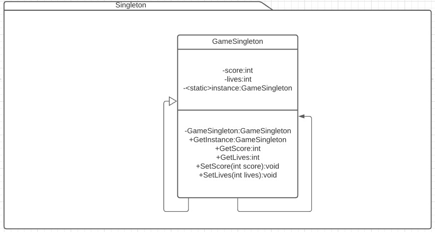

# Singleton

Es un patrón creacional. [Link descripción](https://sourcemaking.com/design_patterns/singleton)

Garantiza que solo exista una instancia y tengamos un método de acceso global a la misma.

## Diagrama de clases

## SOLID

* Single responsibility

La responsabilidad de un singleton es mantener una instancia accesible globalmente y controlar el acceso a sus dependencias. Luego es responsabilidad del desarrollador modelarla correctamente para que tenga una responsabilidad unica.

* Open/Closed principle

Si se hereda la clase para extenderla, habría que modificar el método getInstance para que refleje en la instancia devuelta la funcionalidad heredada.

* Liskov substitution

Heredando la clase singleton debería cumplirse con este principio.

* Interface segregation

Depende del buen criterio del desarrollador.

* Dependency inversion

También depende del criterio del desarrollador.